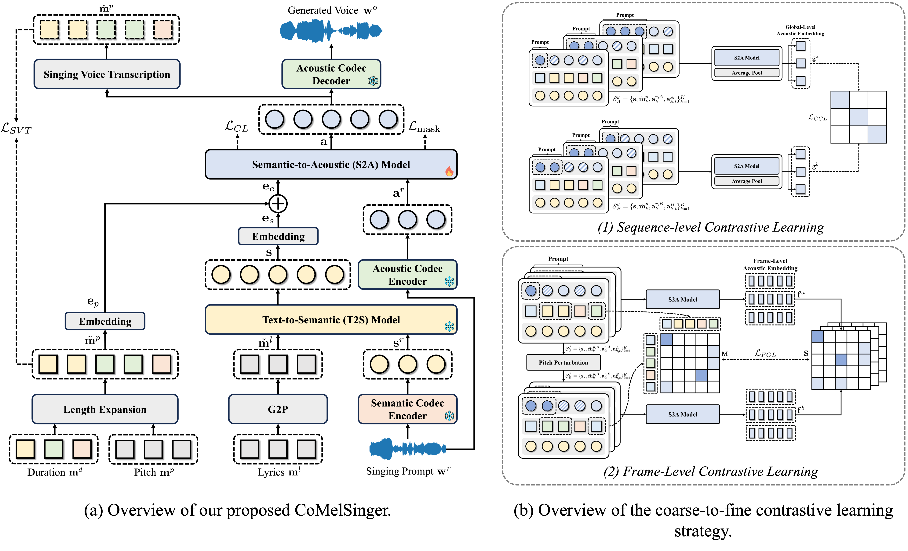

<h1 style="text-align: justify;">
CoMelSinger: Discrete Token-Based Zero-Shot Singing Synthesis With Structured Melody Control and Guidance
</h1>

Paper Link: <a href="https://arxiv.org/pdf/2509.19883" target="_blank">Arxiv</a>

## Abstract of the paper

Singing Voice Synthesis (SVS) aims to generate expressive vocal performances from structured musical inputs such as lyrics and pitch sequences. While recent progress in discrete codec-based speech synthesis has enabled zero-shot generation via in-context learning, directly extending these techniques to SVS remains non-trivial due to the requirement for precise melody control. In particular, prompt-based generation often introduces prosody leakage, where pitch information is inadvertently entangled within the timbre prompt, compromising controllability. We present CoMelSinger, a zero-shot SVS framework that enables structured and disentangled melody control within a discrete codec modeling paradigm. Built on the non-autoregressive MaskGCT architecture, CoMelSinger replaces conventional text inputs with lyric and pitch tokens, preserving in-context generalization while enhancing melody conditioning. To suppress prosody leakage, we propose a coarse-to-fine contrastive learning strategy that explicitly regularizes pitch redundancy between the acoustic prompt and melody input. Furthermore, we incorporate a lightweight encoder-only Singing Voice Transcription (SVT) module to align acoustic tokens with pitch and duration, offering fine-grained frame-level supervision. Experimental results demonstrate that CoMelSinger achieves notable improvements in pitch accuracy, timbre consistency, and zero-shot transferability over competitive baselines. 

## Model Architecture

    
    <figcaption style="text-align: justify; font-family: 'Times New Roman', 'SimSun', '宋体', serif;"> Overview of CoMelSinger (left). It adopts a two-stage pipeline: a T2S model encodes lyrics into semantic tokens, and an S2A model generates acoustic tokens conditioned on lyrics, pitch, and prompt. SVT provides pitch supervision. All modules except S2A are frozen during training. Overview of the coarse-to-fine contrastive learning strategy (right). (a) Sequence-level contrastive learning encourages timbre consistency across different melodies. (b) Frame-level contrastive learning uses pitch perturbation to enforce local pitch-awareness and disentangle melody from timbre.</figcaption>

## Synthesis Results on Seen Singers
<table style="font-family: 'Times New Roman', 'SimSun', '宋体', serif;">
    <tbody>
       <tr>
            <td nowrap>
GT (Codec)
</td>
            <td>
Reference
</td>
            <td>
MaskGCT
</td>
            <td>
Vevo 1.5
</td>
           <td>
CoMelSinger
</td>
        </tr>

        <tr style="background-color: #F0EFF8;">
          <td colspan="5" style="text-align: left; padding: 6px 10px; font-weight: 500;">
            雨会下雨会停这是不变的道理 | yu hui xia yu hui ting zhe shi bu bian de dao li
          </td>
        </tr>

        <tr>
            <td>
                <audio controls style="width: 130px;">
                  <source src="seen/demo-01/GT.wav" type="audio/mpeg">
                  Your browser does not support the audio tag.
                </audio>
            </td>
            <td>
                <audio controls style="width: 130px;">
                  <source src="seen/demo-01/Reference.wav" type="audio/mpeg">
                  Your browser does not support the audio tag.
                </audio>
            </td>
            <td>
                <audio controls style="width: 130px;">
                  <source src="seen/demo-01/maskgct.wav" type="audio/mpeg">
                  Your browser does not support the audio tag.
                </audio>
            </td>
            <td>
                <audio controls style="width: 130px;">
                  <source src="seen/demo-01/vevo.wav" type="audio/mpeg">
                  Your browser does not support the audio tag.
                </audio>
            </td>
            <td>
                <audio controls style="width: 130px;">
                  <source src="seen/demo-01/ours.wav" type="audio/mpeg">
                  Your browser does not support the audio tag.
                </audio>
            </td>
        </tr>

        <tr style="background-color: #F0EFF8;">
          <td colspan="5" style="text-align: left; padding: 6px 10px; font-weight: 500;">
            我听过荒芜变成热闹 | wo ting guo huang wu bian cheng re nao
          </td>
        </tr>

        <tr>
            <td>
                <audio controls style="width: 130px;">
                  <source src="seen/demo-02/GT.wav" type="audio/mpeg">
                  Your browser does not support the audio tag.
                </audio>
            </td>
            <td>
                <audio controls style="width: 130px;">
                  <source src="seen/demo-02/Reference.wav" type="audio/mpeg">
                  Your browser does not support the audio tag.
                </audio>
            </td>
            <td>
                <audio controls style="width: 130px;">
                  <source src="seen/demo-02/maskgct.wav" type="audio/mpeg">
                  Your browser does not support the audio tag.
                </audio>
            </td>
            <td>
                <audio controls style="width: 130px;">
                  <source src="seen/demo-02/vevo.wav" type="audio/mpeg">
                  Your browser does not support the audio tag.
                </audio>
            </td>
            <td>
                <audio controls style="width: 130px;">
                  <source src="seen/demo-02/ours.wav" type="audio/mpeg">
                  Your browser does not support the audio tag.
                </audio>
            </td>
        </tr>

        <tr style="background-color: #F0EFF8;">
          <td colspan="5" style="text-align: left; padding: 6px 10px; font-weight: 500;">
            他说就这样去流浪 | ta shuo jiu zhe yang qu liu lang
          </td>
        </tr>

        <tr>
            <td>
                <audio controls style="width: 130px;">
                  <source src="seen/demo-03/GT.wav" type="audio/mpeg">
                  Your browser does not support the audio tag.
                </audio>
            </td>
            <td>
                <audio controls style="width: 130px;">
                  <source src="seen/demo-03/Reference.wav" type="audio/mpeg">
                  Your browser does not support the audio tag.
                </audio>
            </td>
            <td>
                <audio controls style="width: 130px;">
                  <source src="seen/demo-03/maskgct.wav" type="audio/mpeg">
                  Your browser does not support the audio tag.
                </audio>
            </td>
            <td>
                <audio controls style="width: 130px;">
                  <source src="seen/demo-03/vevo.wav" type="audio/mpeg">
                  Your browser does not support the audio tag.
                </audio>
            </td>
            <td>
                <audio controls style="width: 130px;">
                  <source src="seen/demo-03/ours.wav" type="audio/mpeg">
                  Your browser does not support the audio tag.
                </audio>
            </td>
        </tr>

        <tr style="background-color: #F0EFF8;">
          <td colspan="5" style="text-align: left; padding: 6px 10px; font-weight: 500;">
            你献给我的西班牙馅饼 | ni xian gei wo de xi ban ya xian bing
          </td>
        </tr>

        <tr>
            <td>
                <audio controls style="width: 130px;">
                  <source src="seen/demo-04/GT.wav" type="audio/mpeg">
                  Your browser does not support the audio tag.
                </audio>
            </td>
            <td>
                <audio controls style="width: 130px;">
                  <source src="seen/demo-04/Reference.wav" type="audio/mpeg">
                  Your browser does not support the audio tag.
                </audio>
            </td>
            <td>
                <audio controls style="width: 130px;">
                  <source src="seen/demo-04/maskgct.wav" type="audio/mpeg">
                  Your browser does not support the audio tag.
                </audio>
            </td>
            <td>
                <audio controls style="width: 130px;">
                  <source src="seen/demo-04/vevo.wav" type="audio/mpeg">
                  Your browser does not support the audio tag.
                </audio>
            </td>
            <td>
                <audio controls style="width: 130px;">
                  <source src="seen/demo-04/ours.wav" type="audio/mpeg">
                  Your browser does not support the audio tag.
                </audio>
            </td>
        </tr>

        <tr style="background-color: #F0EFF8;">
          <td colspan="5" style="text-align: left; padding: 6px 10px; font-weight: 500;">
            眼看着灯光熄灭 | yan kan zhe deng guang xi mie
          </td>
        </tr>

        <tr>
            <td>
                <audio controls style="width: 130px;">
                  <source src="seen/demo-05/GT.wav" type="audio/mpeg">
                  Your browser does not support the audio tag.
                </audio>
            </td>
            <td>
                <audio controls style="width: 130px;">
                  <source src="seen/demo-05/Reference.wav" type="audio/mpeg">
                  Your browser does not support the audio tag.
                </audio>
            </td>
            <td>
                <audio controls style="width: 130px;">
                  <source src="seen/demo-05/maskgct.wav" type="audio/mpeg">
                  Your browser does not support the audio tag.
                </audio>
            </td>
            <td>
                <audio controls style="width: 130px;">
                  <source src="seen/demo-05/vevo.wav" type="audio/mpeg">
                  Your browser does not support the audio tag.
                </audio>
            </td>
            <td>
                <audio controls style="width: 130px;">
                  <source src="seen/demo-05/ours.wav" type="audio/mpeg">
                  Your browser does not support the audio tag.
                </audio>
            </td>
        </tr>

        <tr style="background-color: #F0EFF8;">
          <td colspan="5" style="text-align: left; padding: 6px 10px; font-weight: 500;">
            离别轻，暮然回首才被 | li bie qing, mu ran hui shou cai bei
          </td>
        </tr>

        <tr>
            <td>
                <audio controls style="width: 130px;">
                  <source src="seen/demo-06/GT.wav" type="audio/mpeg">
                  Your browser does not support the audio tag.
                </audio>
            </td>
            <td>
                <audio controls style="width: 130px;">
                  <source src="seen/demo-06/Reference.wav" type="audio/mpeg">
                  Your browser does not support the audio tag.
                </audio>
            </td>
            <td>
                <audio controls style="width: 130px;">
                  <source src="seen/demo-06/maskgct.wav" type="audio/mpeg">
                  Your browser does not support the audio tag.
                </audio>
            </td>
            <td>
                <audio controls style="width: 130px;">
                  <source src="seen/demo-06/vevo.wav" type="audio/mpeg">
                  Your browser does not support the audio tag.
                </audio>
            </td>
            <td>
                <audio controls style="width: 130px;">
                  <source src="seen/demo-06/ours.wav" type="audio/mpeg">
                  Your browser does not support the audio tag.
                </audio>
            </td>
        </tr>
    </tbody>
</table>

## Synthesis Results on Unseen Singers
<table style="font-family: 'Times New Roman', 'SimSun', '宋体', serif; width: 100%; max-width: 100%;  border-collapse: collapse;">
    <tbody>
       <tr style="background-color: #EAF2E8;">
          <td colspan="5" style="text-align: center; padding: 6px 10px; font-weight: bold;">
            Male Singer 1: Danny
          </td>
        </tr>
        <tr>
            <td>
Reference
</td>
            <td>
MaskGCT
</td>
            <td>
Vevo 1.5
</td>
           <td>
CoMelSinger
</td>
        </tr>

        <tr style="background-color: #F0EFF8;">
          <td colspan="5" style="text-align: left; padding: 6px 10px; font-weight: 500;">
            早 (G3) 些 (G3) 少 (A3) 年 (E3) 时 (G3) | zao xie shao nian shi
          </td>
        </tr>
        <tr>
            <td>
                <audio controls style="width: 170px;">
                  <source src="unseen/m1/demo-01/reference.wav" type="audio/mpeg">
                  Your browser does not support the audio tag.
                </audio>
            </td>
            <td>
                <audio controls style="width: 170px;">
                  <source src="unseen/m1/demo-01/maskgct.wav" type="audio/mpeg">
                  Your browser does not support the audio tag.
                </audio>
            </td>
            <td>
                <audio controls style="width: 170px;">
                  <source src="unseen/m1/demo-01/vevo.wav" type="audio/mpeg">
                  Your browser does not support the audio tag.
                </audio>
            </td>
            <td>
                <audio controls style="width: 170px;">
                  <source src="unseen/m1/demo-01/ours.wav" type="audio/mpeg">
                  Your browser does not support the audio tag.
                </audio>
            </td>
        </tr>

        <tr style="background-color: #F0EFF8;">
          <td colspan="5" style="text-align: left; padding: 6px 10px; font-weight: 500;">
            痛 (A2) 太 (C3) 美 (D3)，尽 (A2) 管 (C3) 再 (D3) 卑 (G2) 微 (F2) | tong tai mei, jin guan zai bei wei
          </td>
        </tr>
        <tr>
            <td>
                <audio controls style="width: 170px;">
                  <source src="unseen/m1/demo-02/reference.wav" type="audio/mpeg">
                  Your browser does not support the audio tag.
                </audio>
            </td>
            <td>
                <audio controls style="width: 170px;">
                  <source src="unseen/m1/demo-02/maskgct.wav" type="audio/mpeg">
                  Your browser does not support the audio tag.
                </audio>
            </td>
            <td>
                <audio controls style="width: 170px;">
                  <source src="unseen/m1/demo-02/vevo.wav" type="audio/mpeg">
                  Your browser does not support the audio tag.
                </audio>
            </td>
            <td>
                <audio controls style="width: 170px;">
                  <source src="unseen/m1/demo-02/ours.wav" type="audio/mpeg">
                  Your browser does not support the audio tag.
                </audio>
            </td>
        </tr>

        <tr style="background-color: #F0EFF8;">
          <td colspan="5" style="text-align: left; padding: 6px 10px; font-weight: 500;">
            多 (A2) 吹 (A2) 一 (B2) 些 (D3) 风 (G2) | duo chui yi xie feng
          </td>
        </tr>
        <tr>
            <td>
                <audio controls style="width: 170px;">
                  <source src="unseen/m1/demo-03/reference.wav" type="audio/mpeg">
                  Your browser does not support the audio tag.
                </audio>
            </td>
            <td>
                <audio controls style="width: 170px;">
                  <source src="unseen/m1/demo-03/maskgct.wav" type="audio/mpeg">
                  Your browser does not support the audio tag.
                </audio>
            </td>
            <td>
                <audio controls style="width: 170px;">
                  <source src="unseen/m1/demo-03/vevo.wav" type="audio/mpeg">
                  Your browser does not support the audio tag.
                </audio>
            </td>
            <td>
                <audio controls style="width: 170px;">
                  <source src="unseen/m1/demo-03/ours.wav" type="audio/mpeg">
                  Your browser does not support the audio tag.
                </audio>
            </td>
        </tr>
    </tbody>
        
</table>

<table style="font-family: 'Times New Roman', 'SimSun', '宋体', serif; table-layout: fixed;">
    <colgroup>
        <col width="170">
        <col width="170">
        <col width="170">
        <col width="170">
      </colgroup>
    <tbody>
       <tr style="background-color: #EAF2E8;">
          <td colspan="5" style="text-align: center; padding: 6px 10px; font-weight: bold;">
            Male Singer 2: Wei
          </td>
        </tr>
        <tr>
            <td>
Reference
</td>
            <td>
MaskGCT
</td>
            <td>
Vevo 1.5
</td>
           <td>
CoMelSinger
</td>
        </tr>

        <tr style="background-color: #F0EFF8;">
          <td colspan="5" style="text-align: left; padding: 6px 10px; font-weight: 500; word-break: break-word;
      overflow-wrap: break-word;
      white-space: normal;">
            每 (D#3) 一 (F#3) 滴 (B3) 泪 (A#3) 水 (D#3)，都 (D#3) 向 (C#3) 你 (B2) 流 (B2) 淌 (C#3) 去 (D#3) | mei yi di lei shui, dou xiang ni liu tang qu
          </td>
        </tr>
        <tr>
            <td>
                <audio controls style="width: 170px;">
                  <source src="unseen/m2/demo-01/reference.wav" type="audio/mpeg">
                  Your browser does not support the audio tag.
                </audio>
            </td>
            <td>
                <audio controls style="width: 170px;">
                  <source src="unseen/m2/demo-01/maskgct.wav" type="audio/mpeg">
                  Your browser does not support the audio tag.
                </audio>
            </td>
            <td>
                <audio controls style="width: 170px;">
                  <source src="unseen/m2/demo-01/vevo.wav" type="audio/mpeg">
                  Your browser does not support the audio tag.
                </audio>
            </td>
            <td>
                <audio controls style="width: 170px;">
                  <source src="unseen/m2/demo-01/ours.wav" type="audio/mpeg">
                  Your browser does not support the audio tag.
                </audio>
            </td>
        </tr>

        <tr style="background-color: #F0EFF8;">
          <td colspan="5" style="text-align: left; padding: 6px 10px; font-weight: 500; word-break: break-word;
      overflow-wrap: break-word;
      white-space: normal;">
            现 (D3) 在 (F3) 我 (G3) 想 (Bb3) 问 (A3) 问 (D3) 你 (Bb3) | xian zai wo xiang wen wen ni
          </td>
        </tr>
        <tr>
            <td>
                <audio controls style="width: 170px;">
                  <source src="unseen/m2/demo-02/reference.wav" type="audio/mpeg">
                  Your browser does not support the audio tag.
                </audio>
            </td>
            <td>
                <audio controls style="width: 170px;">
                  <source src="unseen/m2/demo-02/maskgct.wav" type="audio/mpeg">
                  Your browser does not support the audio tag.
                </audio>
            </td>
            <td>
                <audio controls style="width: 170px;">
                  <source src="unseen/m2/demo-02/vevo.wav" type="audio/mpeg">
                  Your browser does not support the audio tag.
                </audio>
            </td>
            <td>
                <audio controls style="width: 170px;">
                  <source src="unseen/m2/demo-02/ours.wav" type="audio/mpeg">
                  Your browser does not support the audio tag.
                </audio>
            </td>
        </tr>

        <tr style="background-color: #F0EFF8;">
          <td colspan="5" style="text-align: left; padding: 6px 10px; font-weight: 500; word-break: break-word;
      overflow-wrap: break-word;
      white-space: normal;">
            烛 (C3) 光 (D3) 照 (F3) 亮 (G3) 了 (F3) 晚 (G3) 餐 (A3)，照 (A3) 不 (A3) 出 (G3) 个 (F3) 答 (G3) 案 (A3) ｜ zhu guang zhao liang le wan can, zhao bu chu ge da an
          </td>
        </tr>
        <tr>
            <td>
                <audio controls style="width: 170px;">
                  <source src="unseen/m2/demo-03/reference.wav" type="audio/mpeg">
                  Your browser does not support the audio tag.
                </audio>
            </td>
            <td>
                <audio controls style="width: 170px;">
                  <source src="unseen/m2/demo-03/maskgct.wav" type="audio/mpeg">
                  Your browser does not support the audio tag.
                </audio>
            </td>
            <td>
                <audio controls style="width: 170px;">
                  <source src="unseen/m2/demo-03/vevo.wav" type="audio/mpeg">
                  Your browser does not support the audio tag.
                </audio>
            </td>
            <td>
                <audio controls style="width: 170px;">
                  <source src="unseen/m2/demo-03/ours.wav" type="audio/mpeg">
                  Your browser does not support the audio tag.
                </audio>
            </td>
        </tr>
    </tbody>
        
</table>

<table style="font-family: 'Times New Roman', 'SimSun', '宋体', serif;">
    <tbody>
       <tr style="background-color: #EAF2E8;">
          <td colspan="5" style="text-align: center; padding: 6px 10px; font-weight: bold;">
            Female Singer 1: Sveta
          </td>
        </tr>
        <tr>
            <td>
Reference
</td>
            <td>
MaskGCT
</td>
            <td>
Vevo 1.5
</td>
           <td>
CoMelSinger
</td>
        </tr>

        <tr style="background-color: #F0EFF8;">
          <td colspan="5" style="text-align: left; padding: 6px 10px; font-weight: 500;">
            刻 (F4) 在 (F4) 我 (F3) 心 (Eb4) 底 (D4) 的 (D4) 名 (C4) 字 (D4) | ke zai wo xin di de ming zi
          </td>
        </tr>
        <tr>
            <td>
                <audio controls style="width: 170px;">
                  <source src="unseen/f1/demo-01/reference.wav" type="audio/mpeg">
                  Your browser does not support the audio tag.
                </audio>
            </td>
            <td>
                <audio controls style="width: 170px;">
                  <source src="unseen/f1/demo-01/maskgct.wav" type="audio/mpeg">
                  Your browser does not support the audio tag.
                </audio>
            </td>
            <td>
                <audio controls style="width: 170px;">
                  <source src="unseen/f1/demo-01/vevo.wav" type="audio/mpeg">
                  Your browser does not support the audio tag.
                </audio>
            </td>
            <td>
                <audio controls style="width: 170px;">
                  <source src="unseen/f1/demo-01/ours.wav" type="audio/mpeg">
                  Your browser does not support the audio tag.
                </audio>
            </td>
        </tr>

        <tr style="background-color: #F0EFF8;">
          <td colspan="5" style="text-align: left; padding: 6px 10px; font-weight: 500;">
            刻 (D4) 骨 (C4) 铭 (Eb4) 心 (D4) 只 (C4) 有 (Bb3) 我 (C3) 自 (Bb3) 己 (F3) | ke gu ming xin zhi you wo zi ji
          </td>
        </tr>
        <tr>
            <td>
                <audio controls style="width: 170px;">
                  <source src="unseen/f1/demo-02/reference.wav" type="audio/mpeg">
                  Your browser does not support the audio tag.
                </audio>
            </td>
            <td>
                <audio controls style="width: 170px;">
                  <source src="unseen/f1/demo-02/maskgct.wav" type="audio/mpeg">
                  Your browser does not support the audio tag.
                </audio>
            </td>
            <td>
                <audio controls style="width: 170px;">
                  <source src="unseen/f1/demo-02/vevo.wav" type="audio/mpeg">
                  Your browser does not support the audio tag.
                </audio>
            </td>
            <td>
                <audio controls style="width: 170px;">
                  <source src="unseen/f1/demo-02/ours.wav" type="audio/mpeg">
                  Your browser does not support the audio tag.
                </audio>
            </td>
        </tr>

        <tr style="background-color: #F0EFF8;">
          <td colspan="5" style="text-align: left; padding: 6px 10px; font-weight: 500;">
            我 (A3) 们 (E4) 改 (E4) 变 (E4) 了 (D4) 态 (E4) 度 (D4) 接 (E4) 纳 (D4) 了 (E4) 对 (D4) 方 (D4) ｜ wo men gai bian le tai du jie na le dui fang
          </td>
        </tr>
        <tr>
            <td>
                <audio controls style="width: 170px;">
                  <source src="unseen/f1/demo-03/reference.wav" type="audio/mpeg">
                  Your browser does not support the audio tag.
                </audio>
            </td>
            <td>
                <audio controls style="width: 170px;">
                  <source src="unseen/f1/demo-03/maskgct.wav" type="audio/mpeg">
                  Your browser does not support the audio tag.
                </audio>
            </td>
            <td>
                <audio controls style="width: 170px;">
                  <source src="unseen/f1/demo-03/vevo.wav" type="audio/mpeg">
                  Your browser does not support the audio tag.
                </audio>
            </td>
            <td>
                <audio controls style="width: 170px;">
                  <source src="unseen/f1/demo-03/ours.wav" type="audio/mpeg">
                  Your browser does not support the audio tag.
                </audio>
            </td>
        </tr>
    </tbody>
        
</table>

<table style="font-family: 'Times New Roman', 'SimSun', '宋体', serif;">
    <tbody>
       <tr style="background-color: #EAF2E8;">
          <td colspan="5" style="text-align: center; padding: 6px 10px; font-weight: bold;">
            Female Singer 2: Mian-Mian
          </td>
        </tr>
        <tr>
            <td>
Reference
</td>
            <td>
MaskGCT
</td>
            <td>
Vevo 1.5
</td>
           <td>
CoMelSinger
</td>
        </tr>

        <tr style="background-color: #F0EFF8;">
          <td colspan="5" style="text-align: left; padding: 6px 10px; font-weight: 500;">
            一 (C#4) 寸 (D4) 一 (C#4) 寸 (D4) 填 (F#4) 满 (G3) 欲 (E3) 望 (D3) ｜ yi cun yi cun tian man yu wang
          </td>
        </tr>
        <tr>
            <td>
                <audio controls style="width: 170px;">
                  <source src="unseen/f2/demo-01/reference.wav" type="audio/mpeg">
                  Your browser does not support the audio tag.
                </audio>
            </td>
            <td>
                <audio controls style="width: 170px;">
                  <source src="unseen/f2/demo-01/maskgct.wav" type="audio/mpeg">
                  Your browser does not support the audio tag.
                </audio>
            </td>
            <td>
                <audio controls style="width: 170px;">
                  <source src="unseen/f2/demo-01/vevo.wav" type="audio/mpeg">
                  Your browser does not support the audio tag.
                </audio>
            </td>
            <td>
                <audio controls style="width: 170px;">
                  <source src="unseen/f2/demo-01/ours.wav" type="audio/mpeg">
                  Your browser does not support the audio tag.
                </audio>
            </td>
        </tr>

        <tr style="background-color: #F0EFF8;">
          <td colspan="5" style="text-align: left; padding: 6px 10px; font-weight: 500;">
            只 (Ab3) 是 (Bb3) 哪 (C4) 怕 (Bb3) 周 (C4) 围 (Bb3) 再 (C4) 多 (F4) 人 (C4) | zhi shi na pa zhou wei zai duo ren
          </td>
        </tr>
        <tr>
            <td>
                <audio controls style="width: 170px;">
                  <source src="unseen/f2/demo-02/reference.wav" type="audio/mpeg">
                  Your browser does not support the audio tag.
                </audio>
            </td>
            <td>
                <audio controls style="width: 170px;">
                  <source src="unseen/f2/demo-02/maskgct.wav" type="audio/mpeg">
                  Your browser does not support the audio tag.
                </audio>
            </td>
            <td>
                <audio controls style="width: 170px;">
                  <source src="unseen/f2/demo-02/vevo.wav" type="audio/mpeg">
                  Your browser does not support the audio tag.
                </audio>
            </td>
            <td>
                <audio controls style="width: 170px;">
                  <source src="unseen/f2/demo-02/ours.wav" type="audio/mpeg">
                  Your browser does not support the audio tag.
                </audio>
            </td>
        </tr>

        <tr style="background-color: #F0EFF8;">
          <td colspan="5" style="text-align: left; padding: 6px 10px; font-weight: 500;">
            所 (E4) 有 (F#4) 人 (E4) 都 (D4) 遗 (C#4) 忘 (B3) 了 (E4) 我 (C#4) | suo you ren dou yi wang le wo
          </td>
        </tr>
        <tr>
            <td>
                <audio controls style="width: 170px;">
                  <source src="unseen/f2/demo-03/reference.wav" type="audio/mpeg">
                  Your browser does not support the audio tag.
                </audio>
            </td>
            <td>
                <audio controls style="width: 170px;">
                  <source src="unseen/f2/demo-03/maskgct.wav" type="audio/mpeg">
                  Your browser does not support the audio tag.
                </audio>
            </td>
            <td>
                <audio controls style="width: 170px;">
                  <source src="unseen/f2/demo-03/vevo.wav" type="audio/mpeg">
                  Your browser does not support the audio tag.
                </audio>
            </td>
            <td>
                <audio controls style="width: 170px;">
                  <source src="unseen/f2/demo-03/ours.wav" type="audio/mpeg">
                  Your browser does not support the audio tag.
                </audio>
            </td>
        </tr>
    </tbody>
        
</table>

